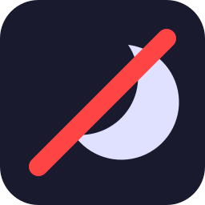

<!-- TODO: one day consider stylized SVG title headers instead of plain markdown headings -->

# No Sleep

> A lightweight web page that keeps your computer awake, no installs needed.

    

**Live:** https://sirbepy.github.io/no_sleep/

---

## About

No Sleep is a simple browser-based tool that prevents your computer from going to sleep. It uses the Wake Lock API to signal activity to your operating system, with a fallback periodic function call.

Features include a running timer, adjustable wake interval, pause/resume, and a technical details panel.

---

## How to run

Open `index.html` in a browser.

---

## Project write-up

See [PORTFOLIO.md](.portfolio-data/PORTFOLIO.md) for the full project write-up.
